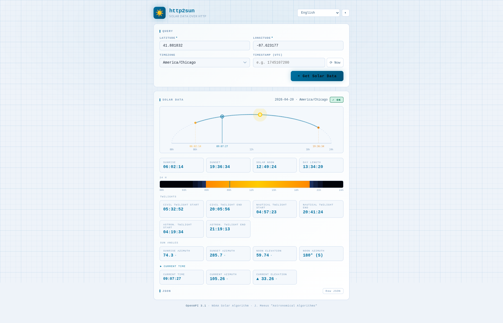

# http2sun

> **Solar Data over HTTP** — A lightweight, stateless HTTP gateway that exposes solar position data (sunrise, sunset, twilights, and sun angles) as a JSON REST API.

Built in Go with **zero external dependencies**, it embeds the full [NOAA Solar Position Algorithm](https://gml.noaa.gov/grad/solcalc/calcdetails.html) (based on Jean Meeus, *Astronomical Algorithms*) and serves all solar data as structured JSON. The binary embeds a static web UI and an OpenAPI specification — no runtime files required.

---

## Screenshot



> The embedded web UI (served at `/`) provides an interactive form to query solar data for any location on Earth. It supports **dark and light themes** and is fully translated into **15 languages**.

---

## Disclaimer

This project is released **as-is**, for demonstration or reference purposes.
It is **not maintained**: no bug fixes, dependency updates, or new features are planned. Issues and pull requests will not be addressed.

---

## License

This project is licensed under the **MIT License** — see the [`LICENSE`](LICENSE) file for details.

```
MIT License — Copyright (c) 2026 letstool
```

---

## Features

- **Zero external dependencies** — the SPA algorithm is implemented directly in Go
- Single static binary — no external runtime files
- Embedded web UI and OpenAPI 3.1 specification (`/openapi.json`)
- Web UI available in **dark and light mode**
- Web UI fully translated into **15 languages**: Arabic, Bengali, Chinese, German, English, Spanish, French, Hindi, Indonesian, Japanese, Korean, Portuguese, Russian, Urdu, Vietnamese
- **RTL support** for Arabic and Urdu
- Solar events: **sunrise, sunset, solar noon, day length**
- Twilight times: **civil, nautical, and astronomical** (begin and end)
- Sun angles: **sunrise azimuth, sunset azimuth, noon elevation, noon azimuth**
- **Polar conditions**: explicit `polar_day` and `polar_night` flags
- Optional `timestamp` parameter (Unix UTC) — defaults to current time when omitted
- Docker image built on `scratch` — minimal attack surface

---

## Build

### Prerequisites

- [Go](https://go.dev/dl/) **1.24+**

### Native binary (Linux)

```bash
bash scripts/linux_build.sh
```

The binary is output to `./out/http2sun`.

```bash
go build \
    -trimpath \
    -ldflags="-extldflags -static -s -w" \
    -tags netgo \
    -o ./out/http2sun ./cmd/http2sun
```

### Windows

```cmd
scripts\windows_build.cmd
```

### Docker image

```bash
bash scripts/docker_build.sh
```

This runs a two-stage Docker build:

1. **Builder** — `golang:1.24-alpine` compiles a static binary
2. **Runtime** — `scratch` image, containing only the binary

The resulting image is tagged `letstool/http2sun:latest`.

---

## Run

### Native (Linux)

```bash
bash scripts/linux_run.sh
```

This sets `LISTEN_ADDR=0.0.0.0:8080` and runs the binary.

### Windows

```cmd
scripts\windows_run.cmd
```

### Docker

```bash
bash scripts/docker_run.sh
```

Once running, the service is available at [http://localhost:8080](http://localhost:8080).

---

## Configuration

Each setting can be provided as a CLI flag or an environment variable. The CLI flag always takes priority. Resolution order: **CLI flag → environment variable → default**.

| CLI flag        | Environment variable | Default         | Description                              |
|-----------------|----------------------|-----------------|------------------------------------------|
| `--listen-addr` | `LISTEN_ADDR`        | `127.0.0.1:8080`| Address and port the HTTP server listens on. |

**Examples:**

```bash
# CLI flag
./out/http2sun --listen-addr 0.0.0.0:9090

# Environment variable
LISTEN_ADDR=0.0.0.0:9090 ./out/http2sun
```

---

## API Reference

### `POST /api/v1/sun`

Returns solar position data for the given location and time.

#### Request body (JSON)

| Parameter   | Required | Default     | Description                                              |
|-------------|----------|-------------|----------------------------------------------------------|
| `latitude`  | ✅       | —           | Decimal degrees, −90 (South Pole) to +90 (North Pole)   |
| `longitude` | ✅       | —           | Decimal degrees, −180 (West) to +180 (East)              |
| `timezone`  | ❌       | `UTC`       | IANA timezone name of the observer's location (e.g. `Europe/Paris`). All output times are expressed in this timezone. |
| `timestamp` | ❌       | now         | Unix timestamp in seconds (UTC epoch, e.g. `1745107200`) |

#### Example request

```bash
# Without timestamp → uses current time
curl -X POST http://localhost:8080/api/v1/sun \\
  -H "Content-Type: application/json" \\
  -d '{"latitude": 48.8566, "longitude": 2.3522, "timezone": "Europe/Paris"}'

# With an explicit Unix timestamp
curl -X POST http://localhost:8080/api/v1/sun \\
  -H "Content-Type: application/json" \\
  -d '{"latitude": 48.8566, "longitude": 2.3522, "timezone": "Europe/Paris", "timestamp": 1745107200}'
```

#### Example response

```json
{
  "latitude": 48.86,
  "longitude": 2.35,
  "timezone": "Europe/Paris",
  "timestamp": 1745107200,
  "date": "2026-04-20",
  "sunrise": "06:31:02",
  "sunset": "20:52:18",
  "solar_noon": "13:41:40",
  "day_length": "14:21:16",
  "civil_twilight_begin": "05:58:41",
  "civil_twilight_end": "21:24:39",
  "nautical_twilight_begin": "05:19:01",
  "nautical_twilight_end": "22:04:19",
  "astronomical_twilight_begin": "04:29:28",
  "astronomical_twilight_end": "22:53:52",
  "sunrise_azimuth_deg": 73.14,
  "sunset_azimuth_deg": 286.86,
  "noon_elevation_deg": 54.22,
  "noon_azimuth_deg": 180,
  "polar_day": false,
  "polar_night": false
}
```

#### Response fields

| Field                        | Type      | Description                                                                   |
|------------------------------|-----------|-------------------------------------------------------------------------------|
| `latitude`                   | `number`  | Observer latitude (degrees)                                                   |
| `longitude`                  | `number`  | Observer longitude (degrees)                                                  |
| `timezone`                   | `string`  | IANA timezone of the observer's location, used for all output times            |
| `timestamp`                  | `integer` | Unix timestamp (UTC midnight of the target local date, seconds since epoch)   |
| `date`                       | `string`  | Target date (YYYY-MM-DD) in the requested timezone                            |
| `sunrise`                    | `string`  | Sunrise time (HH:MM:SS). Empty string during polar night                      |
| `sunset`                     | `string`  | Sunset time (HH:MM:SS). Empty string during polar day                         |
| `solar_noon`                 | `string`  | Solar noon — time of maximum sun elevation (HH:MM:SS)                        |
| `day_length`                 | `string`  | Day length (HH:MM:SS). `00:00:00` = polar night, `24:00:00` = polar day      |
| `civil_twilight_begin`       | `string`  | Civil twilight start — sun 6° below horizon. Empty when not applicable        |
| `civil_twilight_end`         | `string`  | Civil twilight end                                                             |
| `nautical_twilight_begin`    | `string`  | Nautical twilight start — sun 12° below horizon                               |
| `nautical_twilight_end`      | `string`  | Nautical twilight end                                                          |
| `astronomical_twilight_begin`| `string`  | Astronomical twilight start — sun 18° below horizon                           |
| `astronomical_twilight_end`  | `string`  | Astronomical twilight end                                                      |
| `sunrise_azimuth_deg`        | `number`  | Sunrise azimuth, clockwise from north (degrees). 0 when no sunrise            |
| `sunset_azimuth_deg`         | `number`  | Sunset azimuth, clockwise from north (degrees). 0 when no sunset              |
| `noon_elevation_deg`         | `number`  | Sun elevation at solar noon (degrees). Negative during polar night            |
| `noon_azimuth_deg`           | `number`  | Sun azimuth at solar noon — `180` (south) or `0` (north)                     |
| `polar_day`                  | `boolean` | `true` when the sun does not set (midnight sun)                               |
| `polar_night`                | `boolean` | `true` when the sun does not rise                                             |

#### Polar conditions

For locations at high latitudes, the sun may not cross the horizon on some dates:

- **Polar night** (`polar_night: true`): `sunrise` and `sunset` are empty. Some twilight fields may also be empty. `noon_elevation_deg` will be negative.
- **Polar day** (`polar_day: true`): `sunrise` and `sunset` are empty. `day_length` is `24:00:00`.

#### Error response (4xx)

```json
{ "error": "missing required parameter: latitude" }
```

### Other endpoints

| Method | Path            | Description                     |
|--------|-----------------|---------------------------------|
| `GET`  | `/`             | Embedded interactive web UI     |
| `GET`  | `/openapi.json` | OpenAPI 3.1 specification       |
| `GET`  | `/favicon.png`  | Application icon                |

---

## Supported timezones

Any valid IANA timezone name is accepted (e.g. `UTC`, `Europe/Paris`, `America/New_York`, `Asia/Tokyo`, `Australia/Sydney`). The web UI provides a curated dropdown of ~60 common zones. The full IANA database is embedded in the Go standard library's `time` package.

---

## Algorithm

Solar position is computed using the NOAA Solar Position Algorithm, an implementation of the method described in:

> Jean Meeus, *Astronomical Algorithms*, 2nd Edition (1998), Willmann-Bell.

Accuracy: ±1–2 minutes for dates within ±50 years of J2000.0 (January 1, 2000 12:00 TT).

The algorithm computes:
1. Julian Day Number from the target date
2. Julian centuries from J2000.0
3. Sun's mean longitude, mean anomaly, eccentricity
4. Equation of center, true longitude, apparent longitude
5. Obliquity of the ecliptic, declination
6. Equation of time → solar noon in minutes from midnight UTC
7. Hour angle for each zenith angle → rise/set times
8. Azimuth at sunrise/sunset, elevation at noon

---

## Development

```bash
# Tidy dependencies
bash scripts/000_init.sh

# Build and run
bash scripts/linux_build.sh
bash scripts/linux_run.sh

# Integration tests (server must be running)
bash scripts/999_test.sh
```

---

## AI-Assisted Development

This project was developed with the assistance of **[Claude Sonnet 4.6](https://www.anthropic.com/claude)** by Anthropic.

---

## See also

| Projet | GitHub | Docker Hub | Description |
|---|---|---|---|
| `http2tor` | [letstool/http2tor](https://github.com/letstool/http2tor) | [letstool/http2tor](https://hub.docker.com/r/letstool/http2tor) | Lightweight HTTP gateway exposing Tor network detection as a JSON REST API |
| `http2geoip` | [letstool/http2geoip](https://github.com/letstool/http2geoip) | [letstool/http2geoip](https://hub.docker.com/r/letstool/http2geoip) | Lightweight stateless HTTP gateway exposing IP geolocation as a JSON REST API |
| `http2cert` | [letstool/http2cert](https://github.com/letstool/http2cert) | [letstool/http2cert](https://hub.docker.com/r/letstool/http2cert) | Lightweight stateless HTTP gateway exposing X.509 certificate inspection as a JSON REST API |
| `http2dns` | [letstool/http2dns](https://github.com/letstool/http2dns) | [letstool/http2dns](https://hub.docker.com/r/letstool/http2dns) | Lightweight stateless HTTP gateway exposing DNS queries as a JSON REST API |
| `http2whois` | [letstool/http2whois](https://github.com/letstool/http2whois) | [letstool/http2whois](https://hub.docker.com/r/letstool/http2whois) | Lightweight stateless HTTP gateway exposing WHOIS queries as a JSON REST API |
| `http2sun` | [letstool/http2sun](https://github.com/letstool/http2sun) | [letstool/http2sun](https://hub.docker.com/r/letstool/http2sun) | Lightweight stateless HTTP gateway exposing solar position data as a JSON REST API |
